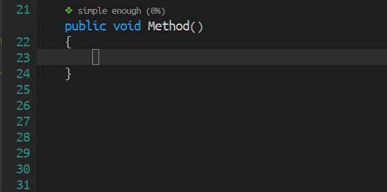

[](https://www.gnu.org/licenses/gpl-3.0)
[](https://jcs-emacs.github.io/jcs-elpa/#/codemetrics)
<a href="#"></a>

# Code Metrics
> Plugin shows complexity information

[](https://github.com/jcs-elpa/codemetrics/actions/workflows/test.yml)



This plugin implements live calculation of the **Cognitive Complexity** metric,
which was proposed by G. Ann Campbell in
[Cognitive Complexity - A new way of measuring understandability](https://www.sonarsource.com/docs/CognitiveComplexity.pdf)
(c) SonarSource S.A. 2016-2021, Switzerland.

> **Abstract:** Cyclomatic Complexity was initially formulated as a measurement
> of the "testability and maintainability" of the control flow of a module.
> While it excels at measuring the former, its underlying mathematical model is
> unsatisfactory at producing a value that measures the latter. This white paper
> describes a new metric that breaks from the use of mathematical models to
> evaluate code in order to remedy Cyclomatic Complexity’s shortcomings and
> produce a measurement that more accurately reflects the relative difficulty of
> understanding, and therefore of maintaining methods, classes, and applications.

<!-- markdown-toc start - Don't edit this section. Run M-x markdown-toc-refresh-toc -->
**Table of Contents**

- [Code Metrics](#code-metrics)
  - [💾 Installation](#💾-installation)
    - [🔍 Method 1. with `straight.el` and `use-package`:](#🔍-method-1-with-straightel-and-use-package)
    - [🔍 Method 2. Manual](#🔍-method-2-manual)
  - [🖥 Usage](#🖥-usage)
    - [📚 Use it as a library](#📚-use-it-as-a-library)
  - [🔨 Supported languages](#🔨-supported-languages)
  - [📝 Customization](#📝-customization)
    - [⚪ Analysis on new nodes](#⚪-analysis-on-new-nodes)
      - [❔ Example](#❔-example)
    - [🔍 Writing new analysis functions](#🔍-writing-new-analysis-functions)
  - [🔗 References](#🔗-references)
  - [🛠️ Contribute](#🛠️-contribute)
    - [🔬 Development](#🔬-development)
    - [❓ How to add an analysis rules?](#❓-how-to-add-an-analysis-rules)
      - [🔍 Where can I look for tree-sitter node?](#🔍-where-can-i-look-for-tree-sitter-node)
  - [⚜️ License](#⚜️-license)

<!-- markdown-toc end -->

## 💾 Installation

### 🔍 Method 1. with `straight.el` and `use-package`:

```elisp
(use-package codemetrics
  :straight (codemetrics :type git :host github :repo "jcs-elpa/codemetrics"))
```

### 🔍 Method 2. Manual

```sh
git clone https://github.com/jcs-elpa/codemetrics /path/to/lib
```

then in Emacs:

```elisp
(add-to-list 'load-path "/path/to/lib")
(require 'codemetrics)
```

or

```elisp
(use-package codemetrics
  :load-path "/path/to/lib")
```

## 🖥 Usage

The simplest way to start using this package:

```elisp
(codemetrics-mode 1)
```

### 📚 Use it as a library

These are functions you can use to analyze:

| Functions             | Description                        |
|-----------------------|------------------------------------|
| `codemetrics-analyze` | Analyze a string with `major-mode` |
| `codemetrics-region`  | Analyze region                     |
| `codemetrics-buffer`  | Analyze the whole buffer           |

All these functions return the score data indicating the complexity.

## 🔨 Supported languages
> ⚠️ Please sort these two lists alphabetically!

These languages are fairly complete:

- Bash
- C / C++ / C#
- Elisp
- Go
- Java / JavaScript / JSX / Julia
- Lua
- PHP / Python
- Ruby / Rust
- Swift
- TypeScript / TSX

These languages are in development:

- Agda
- Elm
- Elixir
- OCaml
- Scala (upstream, kinda buggy)

## 📝 Customization

Although codemetrics aims to have good analysis rules out of the box for all
supported definitions, people will indubitably have their own preferences or
desired functionality. The following section outlines how to add your own
analysis definitions and analysis functions to make codemetrics work for you.
If there are any improvements you find for existing or new languages, please do
raise a PR so that others may benefit from better analysis in the future!

### ⚪ Analysis on new nodes

Code-Metrics defines all its analysis definitions in the variable
`codemetrics-rules` which is an alist with the key of the alist being the
mode and the value being another alist of analysis definitions.

```elisp
;; Example of codemetrics-rules' structure
'((c-mode      . c-analysis-definitions)  ; <language>-analysis-definitions is structured as shown below
  (csharp-mode . csharp-analysis-definitions)
  (go-mode     . go-analysis-definitions)
  (scala-mode  . scala-analysis-definitions)
  ...)

;; Examle of a analysis definition alist
(setq csharp-analysis-definitions
    (if_statement   . (1 t))
    ("&&"           . codemetrics-rules--logical-operators))
```

So you can select whatever node that you want to analyze on it.

To find what node you'll want to analyze, refer to the
[tree-sitter documentation](https://emacs-tree-sitter.github.io/getting-started/#view-the-syntax-tree)
about viewing nodes. `tree-sitter-debug` and `tree-sitter-query-builder`
are both very useful for this.

#### ❔ Example

Let's look at a quick example of adding a new analysis definition. Let's say you
want to add analysis to `go-mode`'s `if_statement`. The analysis definition that
is needed will be `'(if_statement . (1 t))`. To add this to the
`codemetrics-rules`, you can do something like the following.

```emacs-lisp
(push '(if_statement . (1 t)) (alist-get 'go-mode codemetrics-rules))
```

Now the new analysis definition should be usable by codemetrics!

### 🔍 Writing new analysis functions

For more complex analysis, you can write your own analysis rules!

- `node` - (optional) the targeted tree-sitter node, in this example,
`if_statement` will be the targeting node.
- `depth` - (optional) current depth of from the root tree.
- `nested` - (optional) current nested level apply from current complexity
algorithm.

Then the function needs to return an integer represent the score and a
boolean represent increment of the nested level in the form
`(score-to-add . nested?)`. This can be useful if you want to add extra
conditional logic onto your analysis.

As an example of an analysis function, take a look at the definition of the
basic `codemetrics-rules--class-declaration`.

```elisp
(defun codemetrics-rules--class-declaration (_node depth _nested)
  "..."
  (codemetrics-with-complexity
    (if (< 1 depth)  ; if class inside class,
        '(1 nil)     ; we score 1, but don't increase nested level
      '(0 nil))
    '(1 nil)))
```

## 🔗 References

- [codemetrics](https://github.com/kisstkondoros/codemetrics)
- [resharper-cognitivecomplexity](https://github.com/matkoch/resharper-cognitivecomplexity)
- [gocognit](https://github.com/uudashr/gocognit)

## 🛠️ Contribute

[](http://makeapullrequest.com)
[](https://github.com/bbatsov/emacs-lisp-style-guide)
[](https://www.paypal.me/jcs090218)
[](https://www.patreon.com/jcs090218)

If you would like to contribute to this project, you may either
clone and make pull requests to this repository. Or you can
clone the project and establish your own branch of this tool.
Any methods are welcome!

### 🔬 Development

To run the test locally, you will need the following tools:

- [Eask](https://emacs-eask.github.io/)
- [Make](https://www.gnu.org/software/make/) (optional)

Install all dependencies and development dependencies:

```sh
$ eask install-deps --dev
```

To test the package's installation:

```sh
$ eask package
$ eask install
```

To test compilation:

```sh
$ eask compile
```

**🪧 The following steps are optional, but we recommend you follow these lint results!**

The built-in `checkdoc` linter:

```sh
$ eask lint checkdoc
```

The standard `package` linter:

```sh
$ eask lint package
```

*📝 P.S. For more information, find the Eask manual at https://emacs-eask.github.io/.*

### ❓ How to add an analysis rules?

When adding a new analysis rules, add the analysis definition function to
`codemetrics.el` itself near where the other rules functions live and then add
the parser to `codemetrics-rules.el` file. Finally, if you are adding support
for a new language, remember to add it to the `codemetrics-rules` variable.

When creating a new parser, name it `codemetrics-rules-<language>`.

When creating a new analysis function, name it
`codemetrics-rules-<language>-<feature>` or something similar.

#### 🔍 Where can I look for tree-sitter node?

Here are some techniques for finding your desired nodes in tree-sitter.

To look for the correct node you have three options:

- look at the `tree-sitter-[lang]/grammar.js` implementation. In the above
  example, `if_statement` node is defined in the
  [tree-sitter-c-sharp](https://github.com/tree-sitter/tree-sitter-c-sharp)'s
  `grammar.js` file
- open a file of your language choice in emacs and `M-x tree-sitter-debug-mode`.
  This will display the whole s-expr representing your file
- `(message "%S" (tsc-node-to-sexp))` in your function to display what your
  function is seeing

> ⚠️ Warning
>
> Make sure you look into the correct repository. Repositories are managed
> under [tree-sitter-langs](https://github.com/emacs-tree-sitter/tree-sitter-langs)'s
> using git submodule. Some tree-sitter module aren't using the latest version!

## ⚜️ License

This program is free software; you can redistribute it and/or modify
it under the terms of the GNU General Public License as published by
the Free Software Foundation, either version 3 of the License, or
(at your option) any later version.

This program is distributed in the hope that it will be useful,
but WITHOUT ANY WARRANTY; without even the implied warranty of
MERCHANTABILITY or FITNESS FOR A PARTICULAR PURPOSE.  See the
GNU General Public License for more details.

You should have received a copy of the GNU General Public License
along with this program.  If not, see <https://www.gnu.org/licenses/>.

See [`LICENSE`](./LICENSE.txt) for details.
